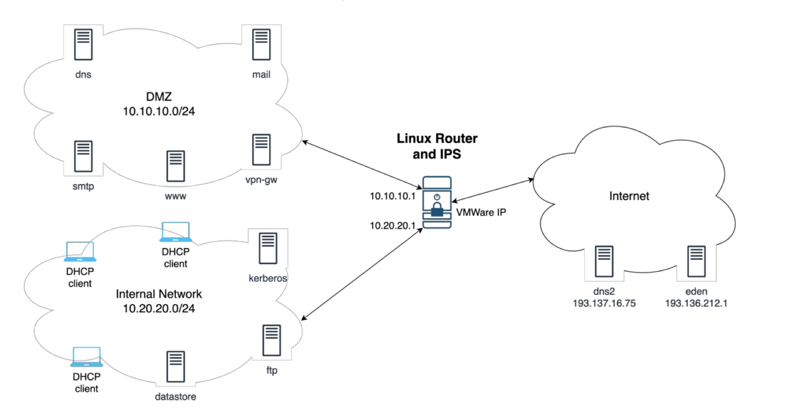

# IPTables + Snort Config Example

## Network Topology


## TCP Sockets with netcat
### Server 
```
nc -lp <port>
```
## Client 
```
nc <ip> <port>
```
## UDP Sockets with netcat
### Server 
```
nc -ulp <port>
```
### Client 
```
nc -u <ip> <port>
```
